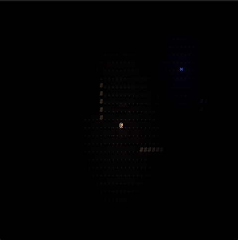
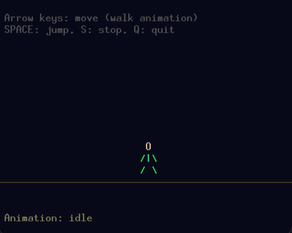
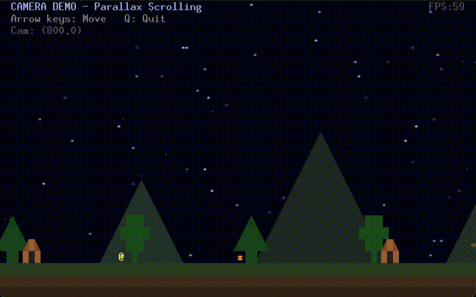

# pyunicodegame

A pygame library for TUI-style unicode graphics with sprites, animations, particles, emitters, a bloom effect, lighting, and a camera system.

## Features

### Dynamic Lighting
Point lights with color, falloff, and shadow casting from sprites.



```python
torch = pyunicodegame.create_light(
    x=30, y=15,
    radius=12,
    color=(255, 180, 100),
    intensity=1.0,
    falloff=1.5,
    follow_sprite=player
)
window.add_light(torch)

wall = pyunicodegame.create_sprite("#", fg=(100, 100, 100), blocks_light=True)
```

### Sprite Animation
Multi-frame sprites with smooth visual offsets (cell position unaffected).



```python
player = pyunicodegame.create_sprite('''
    O
   /|\\
   / \\
''', fg=(0, 255, 100))

player.add_frame('''
   \\O/
    |
   / \\
''')

jump = pyunicodegame.create_animation(
    "jump",
    frame_indices=[0, 1, 1, 1, 0],
    frame_duration=0.1,
    offsets=[(0, 0), (0, -8), (0, -12), (0, -8), (0, 0)],  # Arc upward
    loop=False
)
player.add_animation(jump)
player.play_animation("jump")
```

### Particle Emitters
Configurable particle systems with fading cell-locked or not, emission arcs, unicode characters, colors.


```python
fire = pyunicodegame.create_emitter(
    x=10, y=20,
    chars="*+.",
    colors=[(255, 200, 50), (255, 150, 30), (255, 100, 0)],
    spawn_rate=15,
    speed=6, direction=90, arc=40,
    drag=0.3, fade_time=0.8
)
window.add_emitter(fire)
```

### Bloom Post-Processing
Glow effect for bright pixels, with emissive sprites that bypass the threshold.


```python
window.set_bloom(enabled=True, threshold=180, blur_scale=4, intensity=1.0)

# Bright sprites glow naturally
star = pyunicodegame.create_sprite("*", fg=(255, 255, 200))

# Dim sprites can be marked emissive to glow anyway
orb = pyunicodegame.create_sprite("O", fg=(100, 100, 200), emissive=True)
```

### Parallax Camera
Multi-layer scrolling with depth-based parallax effects in perspective mode. Orthographic mode for plain scrollable windows.



```python
# Background layer - slow parallax
mountains = pyunicodegame.create_window("mountains", 0, 0, 240, 25, z_index=1, depth=4.0)

# Foreground layer - moves with camera
foreground = pyunicodegame.create_window("fg", 0, 0, 240, 25, z_index=10, depth=0.0)

# UI layer - fixed, ignores camera
ui = pyunicodegame.create_window("ui", 0, 0, 80, 25, z_index=100, fixed=True)

pyunicodegame.set_camera(x=400, y=0, mode="perspective", depth_scale=0.1)
```

## Installation

```bash
pip install -e .
```

## Quick Start

```python
import pyunicodegame

def update(dt):
    pass  # Game logic here

def render():
    root = pyunicodegame.get_window("root")
    root.put(10, 5, "@", (0, 255, 0))

pyunicodegame.init("My Game", width=80, height=25)
pyunicodegame.run(update=update, render=render)
```

## Examples

Run the demos in the `examples/` directory:

```bash
python examples/animation_demo.py # Sprite animation
python examples/emitter_demo.py   # Particle effects
python examples/lighting_demo.py  # Lighting & shadows
python examples/bloom_demo.py     # Bloom post-processing
python examples/camera_demo.py    # Parallax scrolling
```
